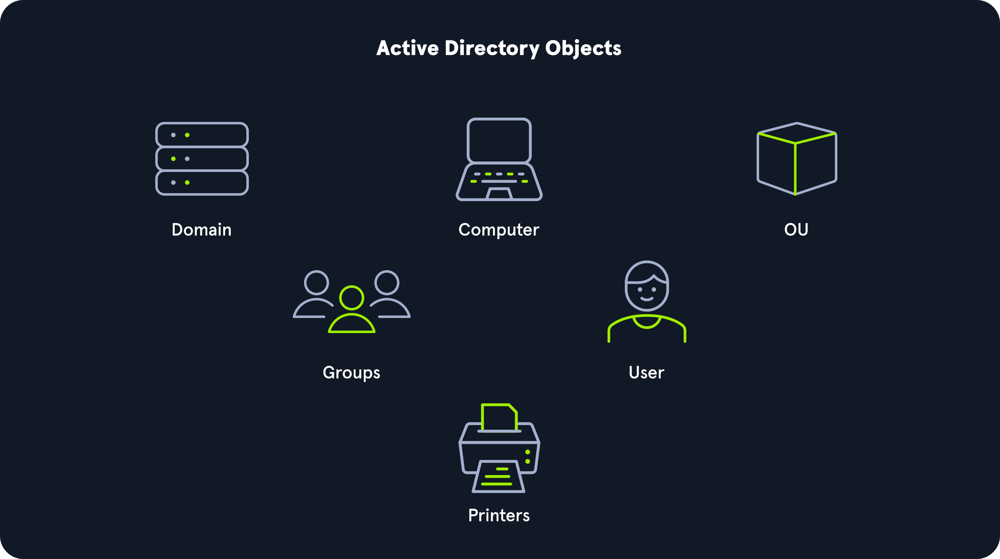
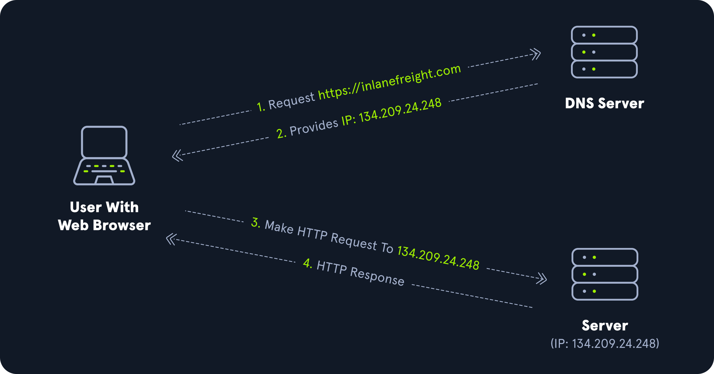

## Mes Etudes d'active Directory
Active Directory est un système qui permet de gérer un ensemble d'ordinateurs et d'utilisateurs connectés au même réseau à partir d'un serveur central.

Les failles et les mauvaises configurations d'Active Directory peuvent souvent être utilisées pour foothold (accès interne), se déplacer latéralement et verticalement au sein d'un réseau et obtenir un accès non autorisé à des ressources protégées telles que des bases de données, des partages de fichiers, du code source, etc.
- AD est essentiellement une grande base de données accessible à tous les utilisateurs du domaine, quel que soit leur niveau de privilège. Un compte utilisateur AD de base sans privilèges supplémentaires peut être utilisé pour énumérer la majorité des objets contenus dans AD, y compris, mais sans s'y limiter, les objets suivants

Domain Computers 	Domain Users
Domain Group Information 	Organizational Units (OUs)
Default Domain Policy 	Functional Domain Levels
Password Policy 	Group Policy Objects (GPOs)
Domain Trusts 	Access Control Lists (ACLs)

Une forest peut contenir plusieurs domaines, et un domaine peut inclure d'autres domaines enfants ou sous-domaines.
Un domaine est une structure au sein de laquelle les objets contenus (utilisateurs, ordinateurs et groupes) sont accessibles. Il comporte de nombreuses unités organisationnelles (OU) intégrées, telles que les contrôleurs de domaine, les utilisateurs et les ordinateurs, et de nouvelles OU peuvent être créées selon les besoins. Les OU peuvent contenir des objets et des sous-OU, ce qui permet d'attribuer différentes stratégies de groupe.

## Active Directory Terminology

- Object
Un objet peut être défini comme toute ressource présente dans un environnement Active Directory, comme les OU, les imprimantes, les utilisateurs, les contrôleurs de domaine, etc.
- Attributes
Chaque objet d'Active Directory est associé à un ensemble d'attributs utilisés pour définir les caractéristiques de l'objet en question. Un objet ordinateur contient des attributs tels que le nom d'hôte et le nom DNS. Tous les attributs d'Active Directory ont un nom LDAP associé qui peut être utilisé lors de requêtes LDAP, comme displayName pour le nom complet et given name pour le prénom.
- Domain
Un domaine est un groupe logique d'objets tels que des ordinateurs, des utilisateurs, des OU, des groupes, etc. Nous pouvons considérer chaque domaine comme une ville différente au sein d'un État ou d'un pays. Les domaines peuvent fonctionner de manière totalement indépendante les uns des autres ou être reliés par des relations de confiance.
- Forest
Un Forest est un ensemble de domaines Active Directory.

- NTDS.DIT
Le fichier `NTDS.DIT` peut être considéré comme le cœur d'Active Directory. Il est stocké sur un contrôleur de domaine à l'emplacement `C:\Windows\NTDS` il s'agit d'une base de données qui stocke les données AD telles que les informations sur les objets utilisateurs et groupes, l'appartenance à un groupe et, ce qui est le plus important pour les attaquants et les testeurs de pénétration, les hachages de mots de passe de tous les utilisateurs du domaine. Une fois le domaine entièrement compromis, un attaquant peut récupérer ce fichier, extraire les hachages et les utiliser pour effectuer une attaque de type "pass-the-hash" ou les craquer hors ligne à l'aide d'un outil tel que Hashcat afin d'accéder à d'autres ressources du domaine. Si le paramètre Stocker le mot de passe avec un cryptage réversible est activé, le NTDS.DIT stockera également les mots de passe en clair pour tous les utilisateurs créés ou qui ont modifié leur mot de passe après que cette politique a été définie. Bien que cela soit rare, certaines organisations peuvent activer ce paramètre si elles utilisent des applications ou des protocoles qui ont besoin d'utiliser le mot de passe existant d'un utilisateur (et non Kerberos) pour l'authentification.

## Active Directory Objects
On parle souvent d'"objets" lorsqu'il s'agit d'AD. Qu'est-ce qu'un objet ? Un objet peut être défini comme TOUTE ressource présente dans un environnement Active Directory, comme les OU, les imprimantes, les utilisateurs, les contrôleurs de domaine.





- Domain Controllers
Les contrôleurs de domaine sont essentiellement le cerveau d'un réseau AD. Ils traitent les demandes d'authentification, vérifient les utilisateurs sur le réseau et contrôlent qui peut accéder aux différentes ressources du domaine. Toutes les demandes d'accès sont validées par le contrôleur de domaine et les demandes d'accès privilégié sont basées sur les rôles prédéterminés attribués aux utilisateurs. Il applique également les politiques de sécurité et stocke des informations sur tous les autres objets du domaine.

## Kerberos, DNS, LDAP, MSRPC
Alors que les systèmes d'exploitation Windows utilisent une variété de protocoles pour communiquer, Active Directory requiert spécifiquement le Lightweight Directory Access Protocol (LDAP), la version Microsoft de Kerberos, le DNS pour l'authentification et la communication, et MSRPC qui est l'implémentation Microsoft de Remote Procedure Call (RPC), une technique de communication interprocessus utilisée pour les applications basées sur le modèle client-serveur.

- Kerberos
Kerberos est le protocole d'authentification par défaut pour les comptes de domaine depuis Windows 2000. Kerberos est une norme ouverte qui permet l'interopérabilité avec d'autres systèmes utilisant la même norme.
Lorsqu'un utilisateur se connecte à son PC, Kerberos est utilisé pour l'authentifier par le biais d'une authentification mutuelle, c'est-à-dire que l'utilisateur et le serveur vérifient tous deux leur identité. Kerberos est un protocole d'authentification sans état basé sur des tickets au lieu de transmettre les mots de passe des utilisateurs sur le réseau. Dans le cadre des services de domaine Active Directory (AD DS), les contrôleurs de domaine disposent d'un centre de distribution de clés Kerberos (KDC) qui émet des tickets. Lorsqu'un utilisateur lance une demande de connexion à un système, le client qu'il utilise pour s'authentifier demande un ticket au KDC, en chiffrant la demande avec le mot de passe de l'utilisateur. Si le KDC peut décrypter la demande (AS-REQ) à l'aide du mot de passe, il crée un ticket d'octroi de ticket (TGT) et le transmet à l'utilisateur. L'utilisateur présente ensuite son TGT à un contrôleur de domaine pour demander un ticket TGS (Ticket Granting Service), crypté avec le hachage du mot de passe NTLM du service associé. Enfin, le client demande l'accès au service requis en présentant le TGS à l'application ou au service, qui le déchiffre avec son hachage de mot de passe. Si l'ensemble du processus se déroule correctement, l'utilisateur est autorisé à accéder au service ou à l'application demandé.

- Kerberos Authentication Process


Le protocole Kerberos utilise le port 88 (à la fois TCP et UDP). Lors de l'énumération d'un environnement Active Directory, nous pouvons souvent localiser les contrôleurs de domaine en effectuant des balayages de ports à la recherche du port 88 ouvert à l'aide d'un outil tel que Nmap.

-  DNS
Les services de domaine Active Directory (AD DS) utilisent le DNS pour permettre aux clients (stations de travail, serveurs et autres systèmes qui communiquent avec le domaine) de localiser les contrôleurs de domaine et aux contrôleurs de domaine qui hébergent le service d'annuaire de communiquer entre eux. Le DNS est utilisé pour résoudre les noms d'hôtes en adresses IP et est largement utilisé dans les réseaux internes et sur l'internet. Les réseaux internes privés utilisent les espaces de noms DNS Active Directory pour faciliter les communications entre les serveurs, les clients et les homologues.



- Forward DNS Lookup
Let's look at an example. We can perform a nslookup for the domain name and retrieve all Domain Controllers' IP addresses in a domain.
```
PS C:\htb> nslookup INLANEFREIGHT.LOCAL

Server:  172.16.6.5
Address:  172.16.6.5

Name:    INLANEFREIGHT.LOCAL
Address:  172.16.6.5

```

- Reverse DNS Lookup

If we would like to obtain the DNS name of a single host using the IP address, we can do this as follows:

```
PS C:\htb> nslookup 172.16.6.5

Server:  172.16.6.5
Address:  172.16.6.5

Name:    ACADEMY-EA-DC01.INLANEFREIGHT.LOCAL
Address:  172.16.6.5

```

- Finding IP Address of a Host

If we would like to find the IP address of a single host, we can do this in reverse. We can do this with or without specifying the FQDN.

```
PS C:\htb> nslookup ACADEMY-EA-DC01

Server:   172.16.6.5
Address:  172.16.6.5

Name:    ACADEMY-EA-DC01.INLANEFREIGHT.LOCAL
Address:  172.16.6.5

```

- LDAP
Active Directory prend en charge le protocole LDAP (Lightweight Directory Access Protocol) pour les recherches dans l'annuaire. LDAP est un protocole open-source et multiplateforme utilisé pour l'authentification auprès de divers services d'annuaire (tels que AD). La dernière spécification LDAP est la version 3, publiée sous la référence RFC 4511. Une bonne compréhension du fonctionnement de LDAP dans un environnement AD est cruciale pour les attaquants et les défenseurs. LDAP utilise le port 389 et LDAP over SSL (LDAPS) communique sur le port 636.
AD stocke les informations relatives aux comptes d'utilisateurs et les informations de sécurité telles que les mots de passe, et facilite le partage de ces informations avec d'autres appareils sur le réseau. LDAP est le langage que les applications utilisent pour communiquer avec d'autres serveurs qui fournissent des services d'annuaire. En d'autres termes, LDAP est la façon dont les systèmes de l'environnement réseau peuvent "parler" à AD.